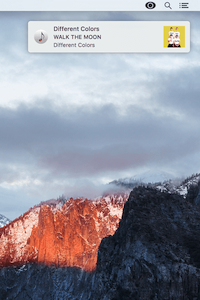
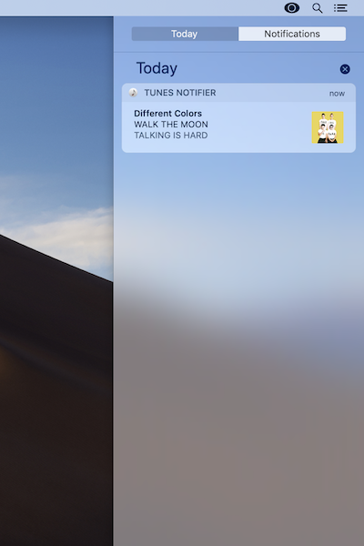
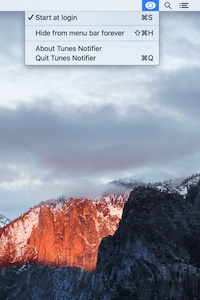
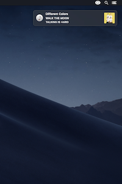

About Tunes Notifier
--------------

Minimal, easy to use macOS application that uses the Notification Center to display the name of the artist, album, song and artwork track any time a song starts playing on Spotify.

**Website:** https://www.tunes-notifier.com

**Contact:** Jules Coynel (jules@56north.co)

Requirements
--------------
Tunes Notifier requires the following
- macOS 10.14 Mojave or later
- Spotify

History
--------------
- **Version 2.0.10** (Submitted to Apple: 15/04/20)
  - Fix blank notification when Spotify doesn't provide song information, usually when playing to an external device 

- **Version 2.0.9** (Submitted to Apple: 17/02/19)
  - Fix album artwork not showing 

- **Version 2.0.8** (Submitted to Apple: 05/02/19)
  - Optimised for macOS Mojave 

- **Version 2.0.7** (Submitted to Apple: 31/12/17)
  - Minor improvements

- **Version 2.0.6** (Submitted to Apple: 26/06/17)
  - Add current song info to menu bar

- **Version 2.0.5** (Submitted to Apple: 25/06/17 - Rejected: 26/06/17)
  - Fix artwork images not loading

- **Version 2.0.4** (Submitted to Apple: 13/09/16 - Released: 13/09/16)
  - Add support for macOS Sierra (10.12)

- **Version 2.0.3** (Submitted to Apple: 11/05/16 - Released: 12/05/16)
  - Fix a crash affecting old versions of Spotify

- **Version 2.0.2** (Submitted to Apple: 06/04/16 - Released: 09/04/16)
  - Restore support for OS X Yosemite (10.10)

- **Version 2.0.1** (Submitted to Apple: 30/03/16 - Released: 01/04/16)
  - Fix incorrect analytics values

- **Version 2.0** (Submitted to Apple: 26/03/16 - Released: 30/03/16)
  - Song artwork visible in notifications
  - New app icon
  - New menu bar icon for "Dark menu bar"
  - No more messages asking you to rate the app
  - OS X El Capitan required 

- **Version 1.6.1** (Submitted to Apple: 15/03/15 - Released: 20/03/15)
  - Fix for Spotify 1.0.1.1060 

- **Version 1.6** (Submitted to Apple: 20/05/14 - Rejected: 21/05/14)
  - Remove iTunes support (as notifications are now natively supported by iTunes)
  - Remove current song info from menu bar (to keep the app minimal)

- **Version 1.5** (Submitted to Apple: 28/07/13 - Rejected: 31/07/13)
  - Add the current song artwork, title, album and artist in the menu bar

- **Version 1.4** (Submitted to Apple: 06/05/13 - Rejected: 12/05/13)
  - Notifications for songs played from radio stations in iTunes

- **Version 1.3** (Submitted to Apple: 30/12/12 – Released: 08/01/13)
  - Spotify support
  - Reduced processor usage
  
- **Version 1.2** (Submitted to Apple: 30/10/12 – Released: 14/11/12)
  - Japanese language support
  - Spanish language support
  - Danish language support
  - Portuguese language support
  - German language support
  - Turkish language support
  - Clean up all notifications when closing Tunes Notifier
  - Various improvements

- **Version 1.1** (Submitted to Apple: 28/09/12 – Released: 18/10/12)
  - New menu bar icon available in colour and in monochrome
  - Menu icon can be removed temporarily or permanently from menu bar
  - New shortcuts
  - Finnish language support

- **Version 1.0** (Submitted to Apple: 23/08/12 – Released: 25/09/12)
  - Initial version

